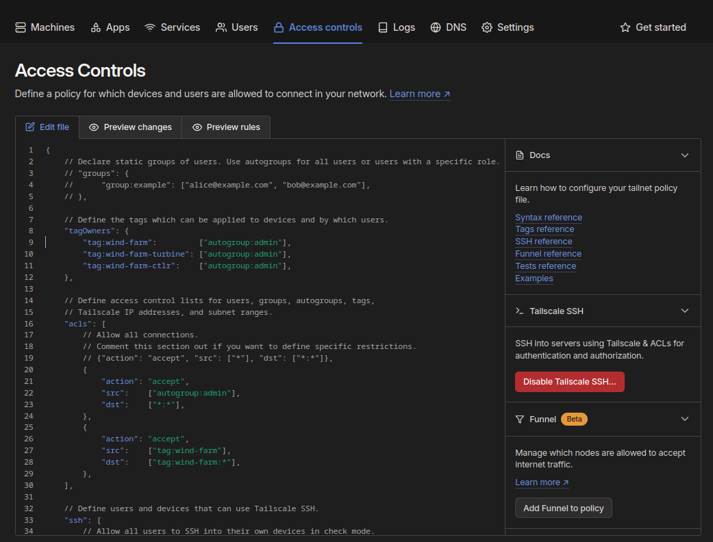
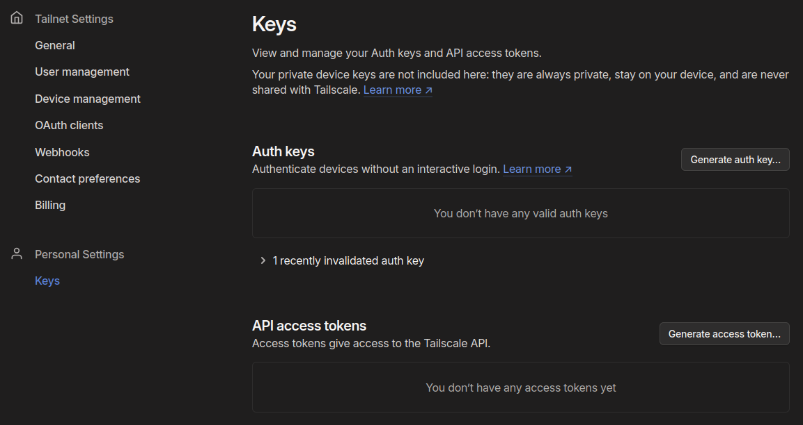
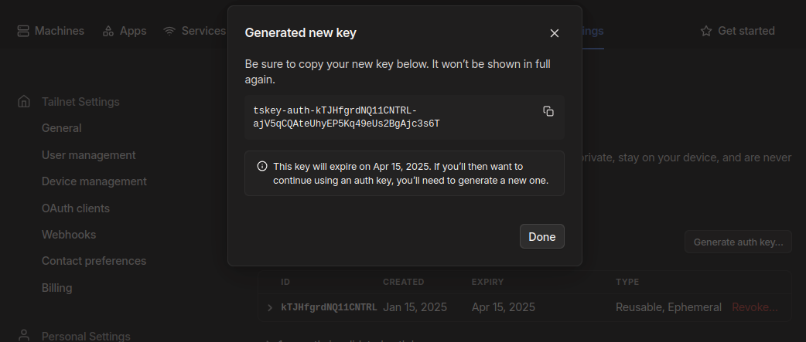
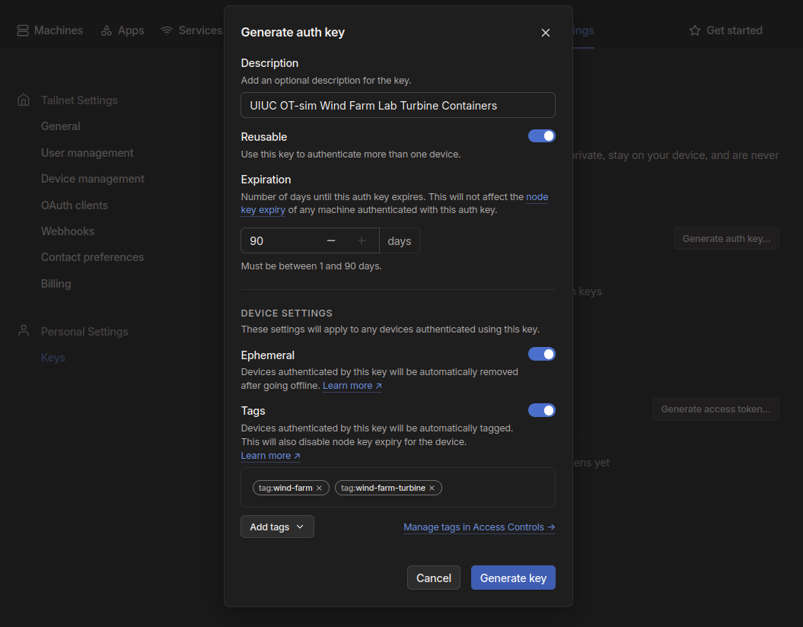
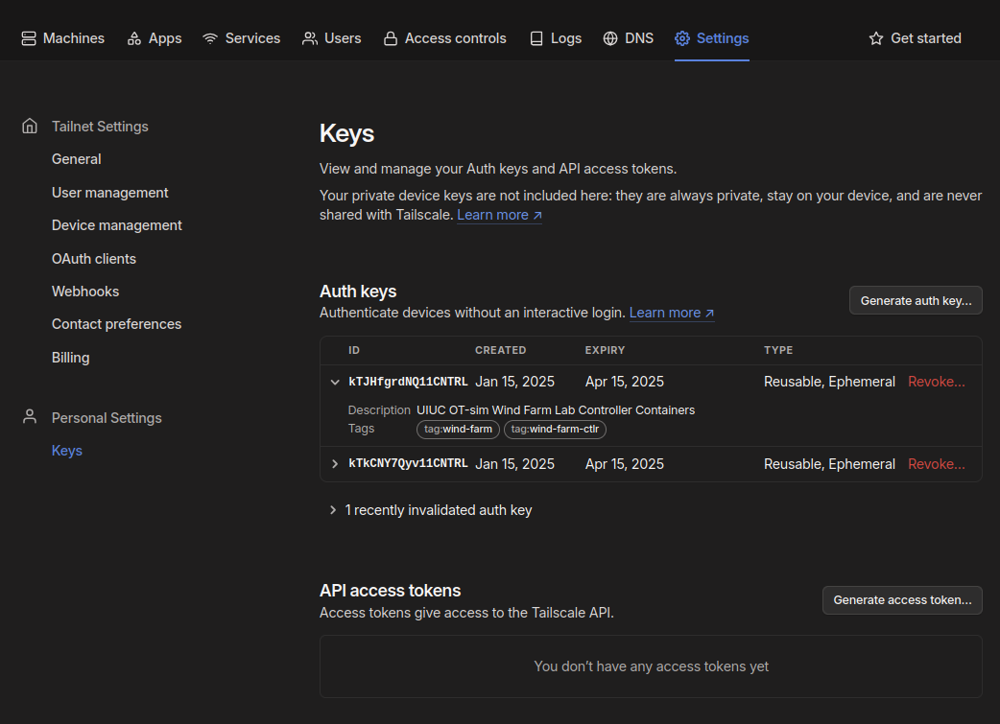

# OT Security Lab: UIUC CS 460 / ECE 419 - Security Laboratory

Welcome to the second OT Security Lab for UIUC course CS 460 / EC419 - Security
Laboratory in December 2024.

This lab has three separate modules, each building on the previous one, in
separate branches. Modules 1 and 2 rely on wind farm controller infrastructure
containers present in this branch to be deployed and connected to the Tailscale
Tailnet used for this lab. Instructions for deploying the wind farm controller
infrastructure follow the Tailscale setup instructions below.

## Tailscale Setup

The lab leader must set up the Tailscale infrastructure for lab participants to
join the wind farm. Access the [Tailscale
administration](https://login.tailscale.com/admin/) interface via a browser.

### Access Control: Edit tagOwners

The Tailscale authentication keys that will be used by lab participants will
include tags to support lab activities. In order to associate tags with
authentication keys, edit the access controls policy file by browsing to the
[Access controls] (https://login.tailscale.com/admin/acls/file) tab and then
clicking `Edit file`.

<p align="center">
  
</p>

Under the `"tagOwners"` key, add the following (see lines 8-12):

```
"tagOwners": {
  "tag:wind-farm":         ["autogroup:admin"],
  "tag:wind-farm-turbine": ["autogroup:admin"],
  "tag:wind-farm-ctlr":    ["autogroup:admin"],
},
```

### Generate Authentication Keys

Click the `Settings` tab and access the
[Keys](https://login.tailscale.com/admin/settings/keys) on the left menu.

<p align="center">
  
</p>

Your browser window should look like the above image.

Generate authentication keys for the Wind Farm Controller and Wind Turbine(s) by 
clicking the `Generate auth key…` button. Create two keys matching the provided 
images. Note the unique Description and Tags for each key.

> [!WARNING]
> Copy each key generated and store for later use in the Gitpod URLs.

<p align="center">
  
</p>

> [!CAUTION]
> You will not be able to access the key in its entirety again.

#### Key for Farm Controller

<p align="center">
  
</p>

#### Key for Turbine Containers

<p align="center">
  
</p>

### Verify the Keys

Click the carrot to the left of each key to confirm it has the correct tags for 
the key description. The carrot for the top key in the image below is extended 
to show its tags.

<p align="center">
  
</p>

### Access Control: Update ACLs

Edit the access controls policy file again by browsing to the [Access
controls](https://login.tailscale.com/admin/acls/file) tab and then clicking
`Edit file`.

Under the `"acls"` key, add the following rule (lines 25-29):

```
{
  "action": "accept",
  "src":    ["tag:wind-farm"],
  "dst":    ["tag:wind-farm:*"],
},
```

> [!NOTE]
> The above ACL allows any device authenticated to Tailscale with an
> authorization key tagged `wind-farm` to talk to any other device authenticated
> with a `wind-farm` on any port. Since both of the authorization keys generated
> above include the more general `wind-farm` tag, any device using those keys to
> authenticate with will be able to talk to each other.

## Wind Controller Setup

In addition to setting up the Tailscale infrastructure as described above, the
lab leader must also deploy the wind farm controller infrastructure for the lab
participants to connect their wind turbines to (over Tailscale).

To deploy the wind farm controller infrastructure, create a Gitpod account (if
needed) and deploy the wind farm controller's Gitpod workspace using the
following URL, replacing `{{FIX_ME}}` with the Farm Controller Tailscale
authorization key created above.

https://gitpod.io/#HOSTNAME=farm-ctlr,OTSIM_TAILSCALE_AUTHKEY={{FIX_ME}}/https://github.com/patsec/uiuc-farm/tree/main

## Lab Participants

To start, create a Gitpod account (if needed) and deploy the initial Gitpod
workspace using the following URL.

https://gitpod.io/#https://github.com/patsec/uiuc-farm/tree/module-0

Follow the README instructions in the workspace.

> [!NOTE]  
> Beginning with module-0, the URLs at the bottom of each README need updating
> for each student. Replace `{{FIX_ME}}` after `HOSTNAME` with the student’s
> turbine identifier (e.g., `wtg-01`). Replace `{{FIX_ME}}` after
> `OTSIM_TAILSCALE_AUTHKEY` with the Turbine key copied and stored when
> generated.
